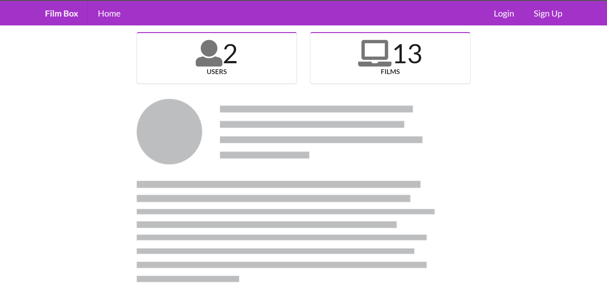
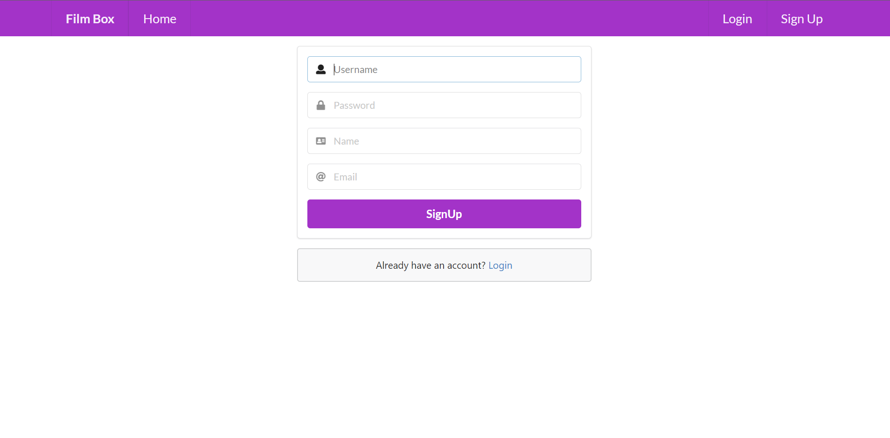
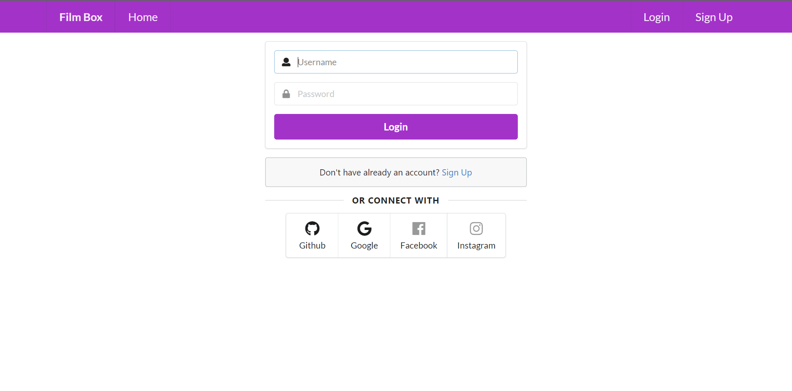
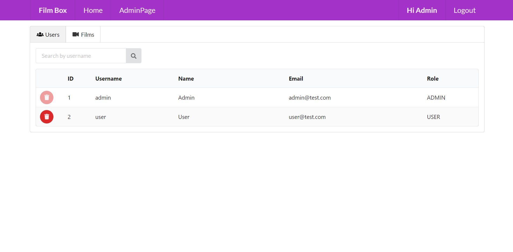
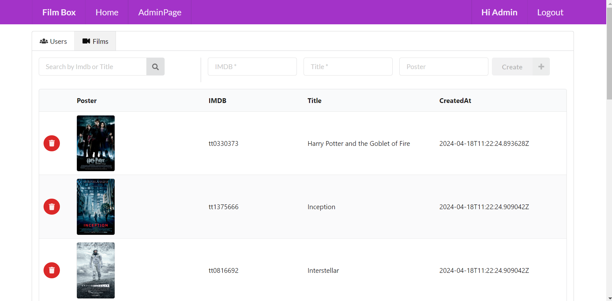
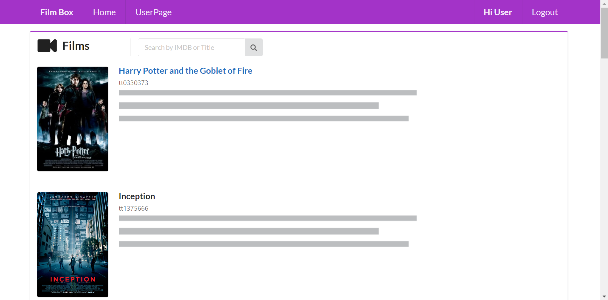

# Film_Box_Project 📽️

## Film Box Project
The Film Box Project aims to implement an application for managing films, consisting of a Spring Boot backend application that exposes a REST API for creating, retrieving, and deleting films. The backend application is secured with JWT access tokens, allowing access to secured endpoints only with a valid token, and a React frontend application where users can retrieve information about films. Users with the ADMIN role have access to all secured endpoints, including endpoints to create and delete films. The project utilizes OAuth2 (Social Login) for securing both applications.

### Backend Features:
- Create, retrieve, and delete films
- Access control based on user roles (USER, ADMIN)
- OAuth2 integration for Social Login (GitHub, Google)
- Store data in a PostgreSQL database

### Frontend Features:
- Retrieve information about films
- Access control based on user roles (USER, ADMIN)
- OAuth2 integration for Social Login (GitHub, Google)
- Semantic UI React used as CSS-styled framework

### Prerequisites:
- [`npm`](https://docs.npmjs.com/downloading-and-installing-node-js-and-npm)
- [`Java 17+`](https://www.oracle.com/java/technologies/downloads/)
- [`Docker`](https://www.docker.com/)
- [`jq`](https://stedolan.github.io/jq)

### Start Environment:
Make sure you are inside the Film_Box_Project root folder.
Run the following command to start Docker Compose containers:
```
docker compose up -d
```

### Running Film_Box_Project using Maven & Npm:

**Backend:**
- Open a terminal and navigate to the `Film_Box_project/backend` folder
- Export the following environment variables for the `Client ID` and `Client Secret` of the Social Apps (see how to get them in [Creating OAuth2 apps for Social Login](#creating-oauth2-apps-for-social-login))
```
export GITHUB_CLIENT_ID=...
export GITHUB_CLIENT_SECRET=...
export GOOGLE_CLIENT_ID=...
export GOOGLE_CLIENT_SECRET=...
```

- Run the following Maven command to start the application:
```
./mvnw clean spring-boot:run
```

**Frontend:**
- Open another terminal and navigate to the `Film_Box_Project/frontend` folder
- Run the following command if you are running the application for the first time
```
npm install
```

- Run the npm command below to start the application:
```
npm start
```

## Applications URLs

| Application  | URL                                   | Credentials                                         |
| ------------ | ------------------------------------- | --------------------------------------------------- |
| backend      | http://localhost:8080/swagger-ui.html |                                                     |
| frontend     | http://localhost:3000                 | `admin/admin`, `user/user` or signing up a new user |


## Util Commands

- **Postgres**
  ```
  docker exec -it postgres psql -U postgres -d film_db
  \dt
  ```

  ## Shutdown

- To stop `backend` and `frontend`, go to the terminals where they are running and press `Ctrl+C`

- To stop and remove docker compose containers, network and volumes, go to a terminal and, inside `Film_Box_Project` root folder, run the command below
  ```
  docker compose down -v
  ```

This README.md provides an overview of the Film Box Project, including instructions for setting up the environment and running both the backend and frontend applications. For more detailed information on specific topics, refer to the relevant sections below.

### How Social Login Works?
For a detailed explanation of how Social Login works in the Film Box Project, refer to the Medium articles mentioned below:
- [**How to Create an OAuth2 App in GitHub**](https://medium.com/@ivangfr/how-to-create-an-oauth2-app-in-github-8e273e376408)
- [**How to Create an OAuth2 App in Google**](https://medium.com/@ivangfr/how-to-create-an-oauth2-app-in-google-10e846d23adb)
- [**Implementing Social Login in a Spring Boot and React App**](https://medium.com/@ivangfr/implementing-social-login-in-a-spring-boot-and-react-app-6ce073c9983c)

## Screenshots














## Contributing

Contributions are welcome! Please fork the repository and create a pull request for any enhancements or bug fixes.


**Developed by [NikKnez](https://github.com/NikKnez)**
